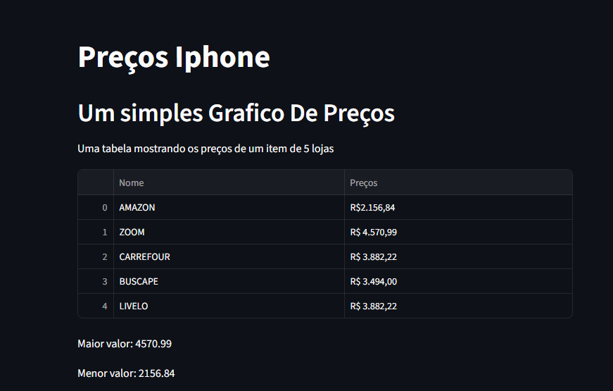
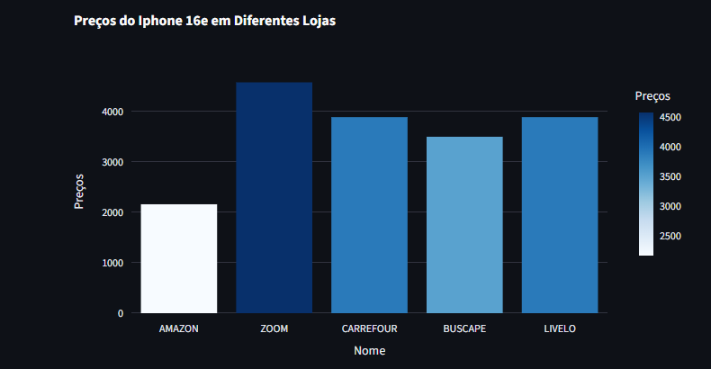

<p align="center">
  
</p>

# 📱 Monitoramento de Preços - iPhone 16


### Um monitor de preços em tempo real para o iPhone 16 que coleta automaticamente os valores das principais lojas online brasileiras e apresenta uma análise comparativa em uma interface web interativa.

## ✨ Funcionalidades
- 🔍 Web Scraping Automático: Coleta preços de 5 lojas online simultaneamente
- 📊 Visualização Interativa: Gráficos dinâmicos com Plotly para comparação de preços
- 🏪 Lojas Monitoradas:
- Amazon
- Zoom
- Carrefour
- Buscapé
- Livelo

- 📈 Análise Comparativa: Identifica automaticamente o maior e menor preço

- 🔄 Atualização em Tempo Real: Execução contínua para monitoramento

- 📱 Interface Web: Dashboard interativo com Streamlit
## Tela Inicial

## Dashboard



## 🛠️ Tecnologias Utilizadas
- Python 3.8+
- Streamlit - Interface web e dashboard

- BeautifulSoup4 - Web scraping e parsing HTML
- Requests - Requisições HTTP para as lojas
- Pandas - Manipulação e estruturação de dados
- Plotly - Visualização de dados e gráficos interativos

## 📦 Instalação
### Pré-requisitos
- Python 3.8 ou superior
- pip (gerenciador de pacotes Python)

### Passo a passo
1️⃣ **Clone o repositório**
````
git clone https://github.com/seu-usuario/monitor-precos-iphone.git
cd monitor-precos-iphone
````
2️⃣ **Crie um ambiente virtual (opcional, mas recomendado)**

```
python -m venv venv
source venv/bin/activate  # Linux/Mac
venv\Scripts\activate #Windowns
```   
3️⃣ **Instale as dependências**

````
pip install -r requirements.txt
````
4️⃣ **Execute a aplicação**
````
streamlit run app.py
````
## 🚀 Como Usar
### Execução Básica
1- Execute o script principal:

````
python monitor_precos.py
````

2 - Acesse o dashboard web:

- Abra seu navegador

- Navegue para http://localhost:8501

- Visualize os preços atualizados automaticamente

## 📊🛠️Funcionalidades do Dashboard
- Tabela de Preços: Visualize os preços brutos coletados de cada loja

- Gráfico de Barras: Compare visualmente os preços entre as lojas

- Destaque de Valores: Identificação automática do maior e menor preço

- Escala de Cores: Gradiente visual para diferenciação de valores

## Personalização
### Para monitorar outros produtos:

- Substitua as URLs no código

- Ajuste os seletores de preço se necessário

- Modifique os nomes das lojas no dashboard
- 
## ❗Limitações
- As lojas podem alterar sua estrutura HTML, quebrando o scraping

- Algumas lojas podem bloquear requisições automatizadas

- O formato de preço pode variar entre lojas
##  🤝 Contribuindo
### Contribuições são bem-vindas!💖 
